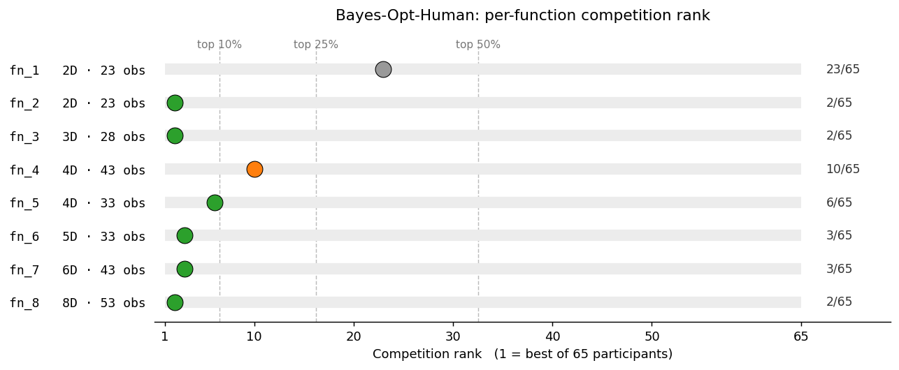

# Bayes-Opt-Human

Bayesian optimization of expensive black-box functions, with a human in the loop.

Bayes-Opt-Human fits a Gaussian process surrogate, generates candidates from several
acquisition strategies, and presents ranked recommendations with rich diagnostics —
but **the user picks the next evaluation point**. Evaluation happens outside the
package: you bring the data, it brings the statistics.

- One step at a time. No automated loop.
- Horizon-aware: the recommendation engine shifts its ranking toward
  exploitation as the evaluation budget is consumed.
- Diagnostic-rich: every recommendation is backed by LOO, coverage, modality, and SVM sense-check.
- Two front-ends: a programmatic `OptimizationStep` API for notebooks, and a Panel web UI.

See [DESIGN.md](DESIGN.md) for the model, diagnostics, and workflow
rationale. See also the model card and datasheet for further
information:

- [model_card.md](model_card.md) — overview, intended use, per-round
  decision logic, performance on the eight capstone functions,
  assumptions, limitations, critical evaluation, and
  ethics/transparency notes.
- [data_sheet.md](data_sheet.md) — motivation, composition, collection
  process, preprocessing, appropriate/inappropriate uses, and
  distribution/maintenance.

## Background

Bayes-Opt-Human was developed as a capstone project for the Imperial College `Machine Learning and Artificial Intelligence` certificate course in 2025/26. Eight black-box functions were provided with initial warmstart data and an optimization budget of 13 weekly evaluations. 

## Outcome



Across the eight capstone functions, the workflow finished in the
top 10% of 65 capstone participants on six functions
(`fn_2`, `fn_3`, `fn_5`, `fn_6`, `fn_7`, `fn_8` — ranks 2 to 6 / 65)
and the top 16% on a seventh (`fn_4` — rank 10 / 65). See
[model_card.md](model_card.md) for the full per-function table
(final values, calibration, kernel, transform) and a critical evaluation.

## Install

```bash
pip install -e .
# Web UI:
pip install -e '.[ui]'
# Jupyter notebook demo (adds ipywidgets so tqdm progress bars render
# without a warning in notebooks/demo.ipynb):
pip install -e '.[notebooks]'
# Tests:
pip install -e '.[dev]'
```

Requires Python 3.10+.

## Quick start

The library follows a `get → report → choose` pattern for each phase: data,
model, and candidate.

```python
from bayesopt_human import OptimizationConfig, OptimizationStep

config = OptimizationConfig(
    name="demo",                         # must match <name>.csv in data_dir
    warmstart=8,
    horizon=20,
    bounds={"x1": (-2.0, 2.0), "x2": (-2.0, 2.0)},
    objective_column="y",
    direction="minimize",
    modality="unimodal",
)
step = OptimizationStep([config])

data_result = step.get_data("data/")
step.report_data(data_result, report="progress", choice=0)
data = step.choose_data(data_result, choice=0)

model_result = step.get_models(data)
step.report_models(model_result, report="all", choice=0)
fitted_gp = step.choose_model(model_result, choice=0)

cand_result = step.get_candidates(data, fitted_gp)
step.report_candidates(cand_result, report="all", choice=1)
next_point = step.choose_candidate(cand_result, choice=1)
```

Evaluate `next_point` externally, append the result to the CSV, and re-run the
cells. See [notebooks/demo.ipynb](notebooks/demo.ipynb) for a complete round trip on a trivial 2D objective.

## Web UI

The repo ships with eight sample problems (2D–8D) and a matching config
file in [data/](data/), so you can launch the UI on concrete data
immediately after installing:

```bash
python -m bayesopt_human.ui --config data/config.py --data-dir data/
```

To run the UI on your own data instead, point the two flags at your own
files:

```bash
python -m bayesopt_human.ui --config path/to/configs.py --data-dir path/to/data/
```

The `--config` file must expose a `CONFIGS` list of `OptimizationConfig`
objects. Each config's `name` must match a `<name>.csv` file in
`--data-dir`. Optional flags: `--port 5006` (default) and `--no-show`
(don't open the browser automatically).

## Acknowledgements

Bayes-Opt-Human was developed with assistance from
[Claude Code](https://docs.claude.com/en/docs/claude-code) (Anthropic's
terminal-based coding assistant) for code generation, refactoring,
and documentation. The author retained final decision authority on
every change.

## License

MIT — see [LICENSE](LICENSE).
