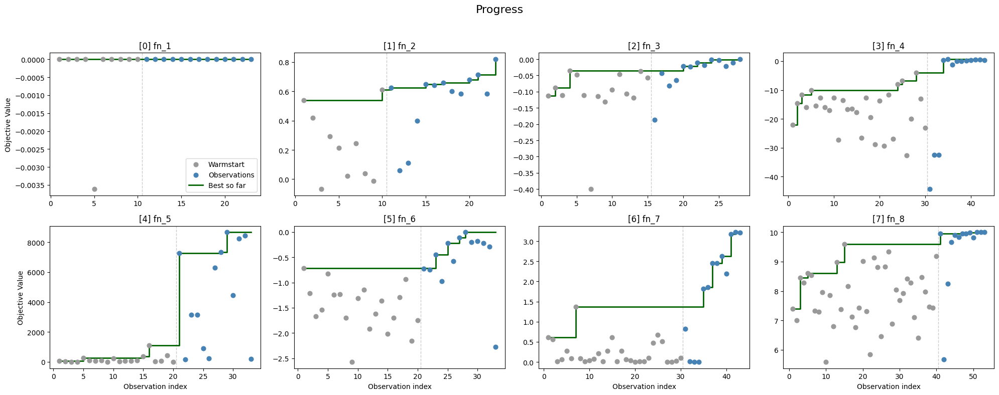

# Model Card: Bayes-Opt-Human

This model card documents **Bayes-Opt-Human**, the optimisation approach used for the Imperial College ML & AI **Bayesian Black-Box Optimisation (BBO)** capstone. Following Mini-lesson 21.2, it covers overview, intended use, technical details, performance across the eight capstone functions, assumptions and limitations, and ethics/transparency.

Bayes-Opt-Human is a *library and workflow* rather than a single trained model. The "approach" is the combination of (a) the library's GP-surrogate + candidate-generation + recommendation pipeline and (b) the human-in-the-loop decisions the author made each round using the library's diagnostics and UI.

## 1. Overview

| Field | Description |
| --- | --- |
| **Name** | Bayes-Opt-Human |
| **Version** | 0.1.0 (final capstone submission state — all thirteen rounds complete; library continues to evolve) |
| **Type** | Interactive Bayesian optimisation pipeline: GP surrogate + diagnostic-rich candidate generation + rule-based recommendation engine + explicit human decision loop |
| **Core components** | GP surrogate via GPyTorch/BoTorch (ARD Matérn-5/2 kernel, adaptive jitter, four output transforms — `none`, `log`, `clipped_log`, `signed_log1p` — optional Beta-CDF input warping); model selector with health-check demotion rules and cross-round inertia via paired LOO-LPD t-tests; eight acquisition strategies (max-min distance in flat and surrogate space, max posterior variance, Expected Improvement, UCB/LCB at three κ levels, max GP mean); horizon-aware rule-based recommendation engine; Panel web UI |
| **Interfaces** | Programmatic `OptimizationStep` API in `bayesopt_human/optimizer/step.py` for notebook use, and a Panel web app at `python -m bayesopt_human.ui` |
| **Repository entry points** | `bayesopt_human/` (library), `notebooks/demo.ipynb` (minimal end-to-end demo), `data/config.py` + `data/fn_1.csv` … `data/fn_8.csv` (the eight capstone problems), `DESIGN.md` (design rationale), `data_sheet.md` (dataset documentation) |
| **License** | MIT |

## 2. Intended use

**Suitable for**

- **Expensive black-box objectives** where each evaluation is costly
  (time, money, physical resources) and the user wants to inspect the
  surrogate's reasoning before committing to the next evaluation.
- **Continuous input spaces** of low-to-moderate dimensionality
  (2–10), specified as per-parameter `(lo, hi)` bounds that the
  library normalises internally to `[0, 1]^D`. The eight capstone
  functions (2D–8D) all sit inside this sweet spot.
- **Known, finite evaluation budgets.** The `horizon` field on
  `OptimizationConfig` is required, and the recommendation engine
  uses it to shift its ranking toward exploitation as the budget is
  consumed.
- **Single-objective** problems in either minimisation or
  maximisation (the BBO capstone uses maximisation).
- **Workflows where the user wants to stay in the loop**: the
  library ranks candidates and explains its reasoning, but the user
  picks the next evaluation point at every round. This is the whole
  point of the approach — the BBO capstone rewards thoughtful
  per-round choices more than a fully automated loop would.

**Should be avoided (without substantial redesign) for**

- **High dimensionality** (roughly `D > 20`). The GP uses a
  full-rank kernel without sparse approximations, so fit time grows
  as `O(n^3)` and ARD length scales struggle to identify relevance
  with small `n`.
- **Categorical or mixed inputs.** The kernel and acquisition
  pipeline assume continuous, box-constrained inputs.
- **Stochastic black-box functions.** The GP fits a fixed-noise model; the BBO
  function evaluations are assumed to be deterministic.
- **Multi-objective, constrained, or safe BO.** None of these are
  implemented. The recommendation rules assume a single scalar
  objective and an unconstrained box.
- **Real-world deployments** where errors carry legal, financial,
  or safety risk. This is a student capstone on synthetic
  objectives; it has no safety story.

## 3. Details: strategy and per-round decision logic

In principle, the approach for every round uses the same library pipeline, and the *structure* and *recommendation engine* are intended to be consistent across the optimisation budget. In practice, the library evolved over multiple months and the author experimented extensively during the first few weeks of the BBO project. It would therefore not be possible to replicate the exact optimisation path which led to the current set of observations with the current (final) workflow. The workflow is also explicitly subject to human intervention and the user can at any step override the deterministic recommendation engine.

**Per-round decision logic.** Each round on each of the
eight functions runs the same three-phase `get → report → choose`
cycle:

```
1. DATA       get_data  → report_data  → choose_data
2. MODEL      get_models → report_models → choose_model
3. CANDIDATE  get_candidates → report_candidates → choose_candidate
```

A more detailed description of the workflow architecture and recommendation logic can be found in [`DESIGN.md`](DESIGN.md).

**Prior beliefs that the author set for each function.** These live in `data/config.py`, were chosen up front based on short qualitative function descriptions provided by the course, and have not been changed since the start of the run:

| Function | Dims | `horizon` | `warmstart` | `modality` |
| --- | ---: | ---: | ---: | --- |
| `fn_1` | 2 | 23 | 10 | `multimodal` |
| `fn_2` | 2 | 23 | 10 | `multimodal` |
| `fn_3` | 3 | 28 | 15 | `unknown` |
| `fn_4` | 4 | 43 | 30 | `unimodal` |
| `fn_5` | 4 | 33 | 20 | `unimodal` |
| `fn_6` | 5 | 33 | 20 | `unimodal` |
| `fn_7` | 6 | 43 | 30 | `unknown` |
| `fn_8` | 8 | 53 | 40 | `unknown` | 

All functions use `direction="maximize"` and `bounds=(0.0, 1.0)` on every dimension. The `horizon` values leave thirteen optimisation-phase evaluations per function on top of the warmstart, matching the thirteen submission rounds.

**How the approach evolved.** Rather than hand-varying the strategy week by week, the author iteratively *improved the library itself* between rounds. Example changes include: dropping horizon-aware κ annealing in favour of letting the
recommendation engine handle budget pressure (so the three UCB candidates stay genuinely distinct in the final rounds); adding cross-round model-change inertia via the paired LOO-LPD t-test; tightening the natural-scale interpretation of LOO-MAE and calibration variance in the diagnostics; introducing the `random_seed` configuration field and reseeding the torch / numpy global RNGs at the start of every `get_models` / `get_candidates` call so runs are bit-reproducible; and adding various diagnostic reports.

## 4. Performance

**Metric.** Best objective value observed on each function after the
final thirteen optimisation rounds. The "initial best" column is the
maximum of the course-provided warmstart outputs; the "final best"
column is the maximum over all rows of the accumulated `data/fn_<k>.csv`
(warmstart plus thirteen optimisation-round submissions). Values were
recomputed directly from the checked-in files at the time this card
was written. The "competition rank" column is the position of the
final best out of 65 capstone participants.

| Function | Dims | Warmstart `n` | Total `n` | Initial best | Final best | Competition rank | Status |
| --- | ---: | ---: | ---: | ---: | ---: | --- | --- |
| `fn_1` | 2 | 10 | 23 | ≈ 7.7e-16 | ≈ 1.78e-08 | 23 / 65 | Degenerate landscape; censoring helped marginally |
| `fn_2` | 2 | 10 | 23 | 0.6112 | **0.819** | **2 / 65** | Steady gains on a shallow peak |
| `fn_3` | 3 | 15 | 28 | −0.0348 | **−3.4e-04** | **2 / 65** | Approached ceiling of a flat landscape |
| `fn_4` | 4 | 30 | 43 | −4.026 | **0.644** | 10 / 65 | Basin jump in mid-run; plateaued in last three rounds |
| `fn_5` | 4 | 20 | 33 | 1088.86 | **8662.48** | 6 / 65 | Boundary optimum; gains slowed after corner identified |
| `fn_6` | 5 | 20 | 33 | −0.7143 | **−5.3e-03** | **3 / 65** | Steady improvement across rounds |
| `fn_7` | 6 | 30 | 43 | 1.3650 | **3.218** | **3 / 65** | Strong gains after exploration revealed a new basin |
| `fn_8` | 8 | 40 | 53 | 9.5985 | **9.996** | **2 / 65** | Diminishing returns — entered final rounds near plateau |

**Final workflow choices.** The selected output transform and kernel
on each function's last round, plus the LOO calibration variance and
LOO-MAE the model carried into that final candidate generation:

| Function | Transform | Kernel | Calibration variance | LOO-MAE |
| --- | --- | --- | ---: | ---: |
| `fn_1` | `clipped_log` | ARD | 0.27 | 0.33 |
| `fn_2` | `signed_log1p` | ARD | 13.91 | 0.29 |
| `fn_3` | `signed_log1p` | ARD | 1.06 | 0.33 |
| `fn_4` | `none` | ISO | 1.02 | 0.12 |
| `fn_5` | `signed_log1p` | ARD | 0.37 | 0.15 |
| `fn_6` | `none` | ARD | 7.09 | 0.23 |
| `fn_7` | `signed_log1p` | ARD | 0.24 | 0.11 |
| `fn_8` | `signed_log1p` | ARD | 0.27 | 0.16 |

**Headline interpretation.** Six of eight functions finished in the
top 10% of capstone participants and a seventh in the top 16%. The one
clear outlier (`fn_1` at rank 23 / 65) is the function whose objective
landscape was effectively flat after every available transform; the
rank reflects a *landscape-bound* limit on what any acquisition
strategy could recover, rather than a workflow failure.

**Progress chart.** The figure below summarises the best-so-far
trajectory on each of the eight functions across the thirteen
optimisation rounds. The chart is generated by the library's own
summary-level `progress` report
(`step.report_data(result, report="progress")`) against the latest
`data/fn_<k>.csv` files.



**Notes on interpretation**

- Percentages and cross-function deltas are not meaningful because the objective scales differ by many orders of magnitude (compare `fn_5` ≈ 8660 with `fn_1` ≈ 1e-08).
- `fn_1` never escaped the vicinity of zero. The raw data includes negative and positive objective values. The difference in positive values is much smaller than the variation in negative values. In order to accentuate differences between positive values and prevent larger negative values from dominating the surrogate function, a `clipped_log` output transform has been applied which censors negative values.

## 5. Assumptions and limitations

**Assumptions**

- **Local smoothness.** The Matérn-5/2 kernel is twice differentiable;
  sharply discontinuous or piecewise-constant objectives fit poorly
  and the calibration-variance diagnostic will flag it.
- **Stationarity (weak).** Kernel hyperparameters are shared across
  the input domain. Strongly non-stationary functions (e.g., a flat
  region next to a narrow peak) can mislead the posterior far from
  data; ARD helps when the non-stationarity is factorised.
- **Deterministic objective function.** The library treats observations as
  noiseless and adaptive jitter exists only for numerical stability.
- **Unit-cube is the right box.** All internal operations run in
  `[0, 1]^D` after bounds normalisation. If the true optimum lies
  outside the declared box, no diagnostic will catch it; for the
  BBO capstone the functions are defined on the unit hypercube.
- **Known, finite horizon.** The urgency signal in the
  recommendation engine and the cross-round inertia rules assume the
  user committed to a total budget up front.

**Limitations and failure modes**

- **Small `n`, moderate `D`.** Even in the 2D–8D BBO regime, early
  rounds can leave the GP with very few points; ARD length scales
  sometimes collapse to the permitted bounds (which the demotion
  rules flag) and the first few recommendations can look
  indistinguishable. The author mitigated this by trusting the
  space-filling candidates early and the exploitation candidates
  late.
- **Flat or near-constant regions (`fn_1`).** The optimiser has struggled to find a clear maximum for `fn_1`, which may be due to the absence of clear peaks in that function, or a misspecification of the GP surrogate models (e.g. assumption of stationarity)
- **Full-rank GP scaling.** Fit time grows as `O(n^3)`. For the
  capstone's 13-round budget this is fine (total `n` never exceeds
  ~50), but the pipeline would need sparse GPs for longer runs.
- **Reliance on unvalidated "common-sense" heuristics and
  hyperparameters.** Many of the thresholds and defaults inside the
  library were chosen by plausibility rather than by empirical
  validation: the demotion bands for calibration variance
  (`[0.1, 5.0]` red / `[0.5, 2.0]` green), the "majority of
  dimensions at the length-scale bounds" rule, the 0.5-nat LPD gap
  used by the parsimony tie-break, the two t-statistic thresholds
  for between-round model switching (2.0 for same/simpler kernels,
  3.0 for more complex ones), the three base κ values
  `(0.5, 1.5, 2.5)`, the 50% / 20% horizon breakpoints used by the
  recommendation engine's urgency signal, and the `k = 5` default
  for the KNN-based coverage and modality diagnostics all fall into
  this category. They are defensible, documented in `DESIGN.md`,
  and traceable in the code, but none has been tuned against a
  held-out benchmark, so a systematic ablation could plausibly show
  any of them to be sub-optimal for a given class of problem.
- **Limited external benchmarking.** The competition rank against
  64 other capstone participants (§4) provides one external
  comparison point: the workflow finished in the top 10% on six of
  eight functions and the top 16% on a seventh. However, the
  eight functions are a small fixed set rather than a randomised
  test suite. The library has *not* been evaluated against standard
  black-box optimisation test suites or compared head-to-head with
  baseline BO packages on a shared problem. A serious external
  audit would still need systematic benchmark runs against a
  reference library (e.g. BoTorch's built-in BO loop) on a shared
  test suite before quantitative claims could be made about *which
  design choices* drive the result.
- **Human-strategy mistakes.** The user can override the
  recommendation at every round. This can improve or degrade performance compared to a fully automated run. For the
  capstone the author erred on the side of accepting the
  recommendations unless the diagnostic reports made a clear case
  otherwise.

**Empirical critique of the result.**

Six of eight functions finished in the top 10% of capstone participants
(ranks 2 to 6 / 65) and a seventh in the top 16%. The features of the
workflow that most plausibly drove this:

- **Diagnostic-first approach.** Calibration variance, length-scale
  health, and stagnation surfaced model pathologies before they reached
  the candidate ranking.
- **Output-transform menu.** `clipped_log` rescued the only function
  with a heavily mixed-sign objective (`fn_1`); `signed_log1p` was
  selected on six of eight runs and demonstrably improved fit on
  multi-scale outputs.
- **Iterating on the tool, not the moves.** Library improvements
  between rounds compounded in a way that round-by-round tactical
  variation would not have.
- **Explicit horizon awareness.** Late-round exploitation bias paid
  off on `fn_2`, `fn_6`, `fn_7`, and `fn_8`.

The same evidence reveals where the workflow underperformed:

- **`fn_4`: kernel-choice plateau.** The only function with a final
  ISO-kernel pick. After the basin jump in mid-run it produced no
  further gains. ARD might have identified a better local descent
  direction, but the simplicity prior won the model-selection vote.
  Rank 10 / 65 — defensible but the weakest of the seven non-`fn_1`
  results.
- **`fn_5`: boundary optimum unverified.** Exploitation around the
  corner stopped paying off after the corner was identified, and
  exploration of other corners did not help either. The final value is
  plausible but unverified.
- **Explore/exploit reflex inversion under sustained miscalibration.**
  Under persistent miscalibration the author switched back to
  exploitation, which is the opposite of what the recommendation engine
  prescribes (DESIGN §8: under poor calibration, weight flows to
  *geometric* exploration). The outcomes on `fn_2` and `fn_6` (both
  with bad calibration but good ranks) suggest this was not always
  wrong, but the engine's prescribed fallback was never tested
  head-to-head in the same conditions.

**Failure modes the workflow itself would not catch.**

- **Non-stationarity.** The Matérn kernel assumes one length-scale
  regime. A function with sharply different smoothness in different
  regions would be misfit globally, and no diagnostic in the current
  set would flag it cleanly.
- **Confirmation of a boundary optimum.** The acquisition functions
  can propose corner points, but no diagnostic tells the user whether
  they have actually found the boundary optimum or are still on the
  way.
- **Modality below the density threshold.** The KNN modality diagnostic
  is gated by `N / D ≥ 5`. Several of the capstone functions never
  crossed that threshold, so the modality verdict on those runs was
  silently unavailable rather than wrong.

**Planned improvements.**

1. **Non-stationary surrogate models.** Several of the objective
   functions appear not to satisfy the assumption of stationarity. If
   a function has dramatically different characteristic length scales
   in different regions, any stationary GP will struggle to produce a
   sensible trajectory of function evaluations.
2. **Asymmetric handling of calibration variance.** The workflow
   currently flags models that are either overconfident or
   underconfident, and treats the two cases the same way. Using the
   sign of the deviation directly — for example, to correct the
   posterior variance — could let the exploit and model-explore arms
   degrade at different rates.
3. **Benchmark against reference libraries.** The competition rank
   provides one external benchmark, but the empirical evidence is
   still limited to the eight capstone functions and a single run for
   each. A systematic comparison against BoTorch's built-in BO loop
   (or other optimisation libraries) on a shared test suite would
   provide a quantitative test for the recommendation engine, and
   could be used to calibrate some of the heuristic hyperparameters.

## 6. Ethical considerations and transparency

- **Transparency.** Every recommendation the library produces is
  backed by an explicit plain-language rationale that cites the
  diagnostics behind it (e.g., *"First round. Picked the simplest
  model within 0.5 nats of the best LOO-LPD"* or *"`log` (ARD) is
  significantly better than the previous choice `none` (ISO)
  (t=3.21, p=0.0034, more complex — higher threshold required)"*).
  The reporting registries at
  `bayesopt_human/reporting/{data,models,candidates}.py` are the
  single source of truth for the set of available diagnostics and
  are surfaced through the same `report_*` API in both the
  notebook and the Panel UI, so a reader can reproduce any table
  or plot by calling the relevant `report_*` method on the
  committed CSV.
- **Reproducibility.** Setting `OptimizationConfig.random_seed=42`
  (the default) reseeds the torch and numpy global RNGs at the
  start of every `get_models` and `get_candidates` call, and the
  sklearn calls that accept one pass `random_state=0`. The
  regression test in `tests/test_optimizer/test_step_api.py`
  exercises this end to end: it runs the full three-phase
  pipeline twice on the same data and asserts every candidate's
  raw coordinates match bit-for-bit. Optimiser state is persisted
  as an append-only JSON file per config (`fn_<k>_state.json`,
  tracked in the repository alongside the CSV), so a multi-round
  session can be paused, resumed, audited, or replayed — and the
  committed history of past model and candidate choices is part
  of the repo's audit trail.
- **Tooling disclosure.** The codebase, the test suite, and this
  model card were developed with assistance from **Claude Code**
  (Anthropic's terminal-based coding assistant, running Claude
  Opus 4.6) acting as a pair-programmer for code generation,
  refactoring, documentation drafting, and review. Final acceptance of every change —
  including the decision of what to include, what to discard, and
  how to frame the documentation — was the author's.
- **Real-world adaptation.** This card makes explicit that the
  library has only been validated on the eight synthetic BBO
  capstone functions (plus its own test suite). It has not been
  tested against real expensive objectives, and it has no
  mechanisms for auditing bias, enforcing constraints, handling
  noisy/stochastic oracles, or preventing misuse. Any transfer
  to a real-world setting with consequential decisions would
  require a problem-specific risk analysis.

